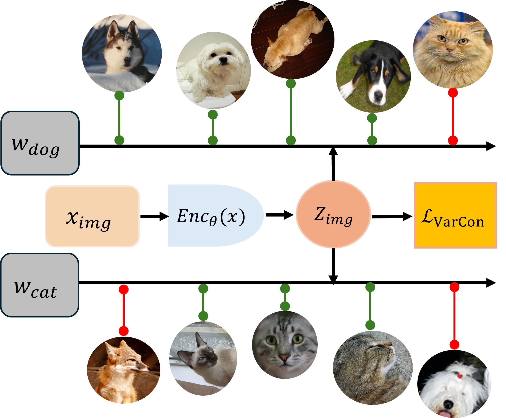
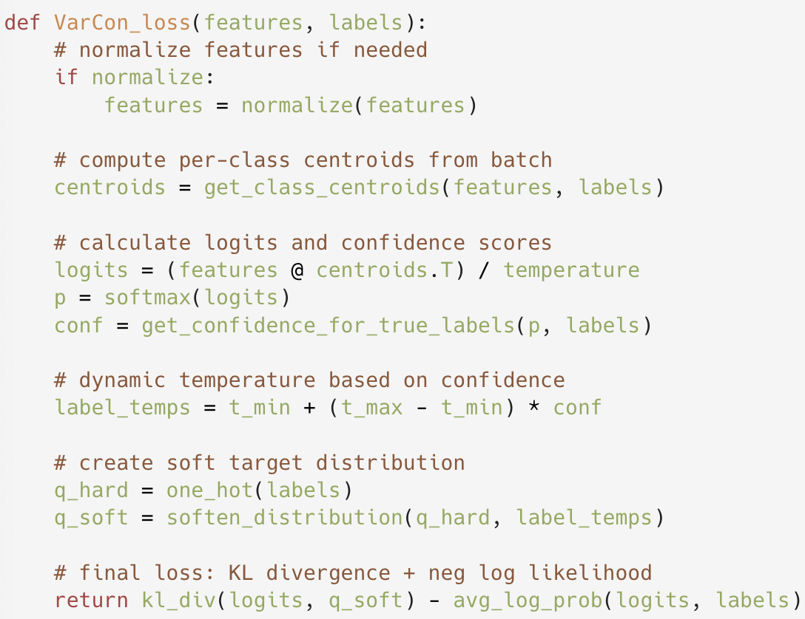

# VarCon: Variational Supervised Contrastive Learning

This repository contains a PyTorch implementation of **Variational Supervised Contrastive Learning (VarCon)** from:

> **Variational Supervised Contrastive Learning**  
> Ziwen Wang, Jiajun Fan, Thao Nguyen, Heng Ji, Ge Liu  
> NeurIPS 2025

The code is built on top of a ResNet backbone and a VarCon loss, and supports multi-GPU training via `torchrun`.  
Pretrained checkpoints for ImageNet will be released soon. We appreciate your patience.

Backbone and utilities are largely adapted from:

- [SupContrast](https://github.com/HobbitLong/SupContrast)  
- [pytorch-classification](https://github.com/bearpaw/pytorch-classification)

## Overview

<p align="center">
  
  &nbsp;&nbsp;
  
</p>

<p align="center"><b>Figure:</b> VarCon architectural flowchart and pseudocode.<br>
<b>Left:</b> Input images are processed through an encoder network to produce ℓ₂-normalized embeddings <b>z</b>. Class-level centroids <b>w</b><sub>r</sub> are computed dynamically from mini-batch embeddings. The model determines sample's classification difficulty and applies confidence-adaptive temperature scaling τ₂(<b>z</b>), which tightens constraints on challenging samples and relaxes them for well-classified examples.<br>
<b>Right:</b> Pseudocode implementation of our ELBO-derived loss function combining KL divergence and negative log-likelihood terms.</p>

## Installation
```bash
git clone https://github.com/ziwenwang28/VarContrast.git
cd VarContrast

pip install -r requirements.txt
```

Make sure you have a working CUDA + NCCL setup for multi-GPU training.

## VarCon Training (CIFAR-100)

Example: train VarCon on CIFAR-100 with 8 GPUs, per-GPU batch size 128 (total batch size 1024), temperature τ₁ = 0.1:
```bash
torchrun --nproc_per_node=8 main_varcon.py \
  --method VarCon \
  --dataset cifar100 \
  --model resnet50 \
  --batch_size 128 \
  --epochs 200 \
  --learning_rate 0.5 \
  --weight_decay 1e-4 \
  --temp 0.1 \
  --epsilon 0.02 \
  --cosine \
  --warm \
  --trial 1
```

Checkpoints and $\tau_2$ statistics are saved under:
```text
./save/VarCon/cifar100_models/VarCon_cifar100_resnet50_mlp_lr_0.5_decay_0.0001_bsz_128_temp_0.1_trial_1_eps_0.02_cosine_warm/
```

## Linear Evaluation (CIFAR-100)

After VarCon pretraining, you can train a linear classifier on frozen VarCon features using `main_linear.py`.

Example (again using 8 GPUs, per-GPU batch size 128):
```bash
torchrun --nproc_per_node=8 main_linear.py \
  --dataset cifar100 \
  --model resnet50 \
  --ckpt ./save/VarCon/cifar100_models/VarCon_cifar100_resnet50_mlp_lr_0.5_decay_0.0001_bsz_128_temp_0.1_trial_1_eps_0.02_cosine_warm/last.pth \
  --batch_size 128 \
  --learning_rate 5.0 \
  --epochs 100
```

This script freezes the encoder and trains only the linear classifier head, reporting global Top-1 / Top-5 accuracy across all GPUs.

## Repository Structure
```
VarContrast/
├── main_varcon.py          # DDP training script for VarCon
├── main_linear.py          # DDP linear evaluation on frozen VarCon encoder
├── losses.py               # VarCon loss implementation
├── util.py                 # Transforms, meters, LR scheduling, DDP helpers
├── networks/
│   └── resnet_big.py       # ResNet backbone, VarCon head, LinearClassifier
├── assets/
│   ├── flowchart.jpg
│   └── pseudo.png
├── requirements.txt
└── README.md
```

## Citation

If you find this repository helpful, please consider citing:
```bibtex
@inproceedings{
  wang2025variational,
  title={Variational Supervised Contrastive Learning},
  author={Ziwen Wang and Jiajun Fan and Thao Nguyen and Heng Ji and Ge Liu},
  booktitle={The Thirty-ninth Annual Conference on Neural Information Processing Systems},
  year={2025},
  url={https://openreview.net/forum?id=uOOlHOq500}
}
```
